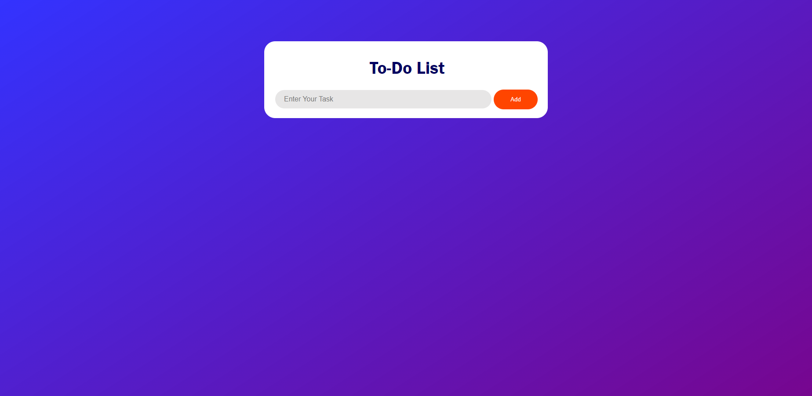
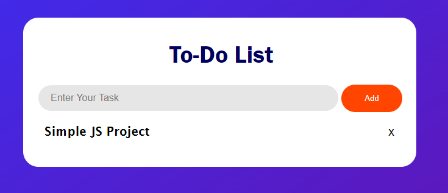
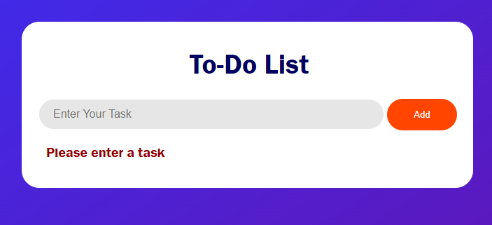

## Simple To-Do List Project
 This is a simple **Javascript Project** .
 
 *Todo List* is a simple project that every beginner should practice doing.
 So hope this will be a good example.
 ### User Interface - When tasks are **not entered**
 

 ### User Interface - When tasks are **entered**
 

 ### User Interface - When the user didn't enter any task but clicked the **add button**
 

 ### Thanks Have a Great Day 😁